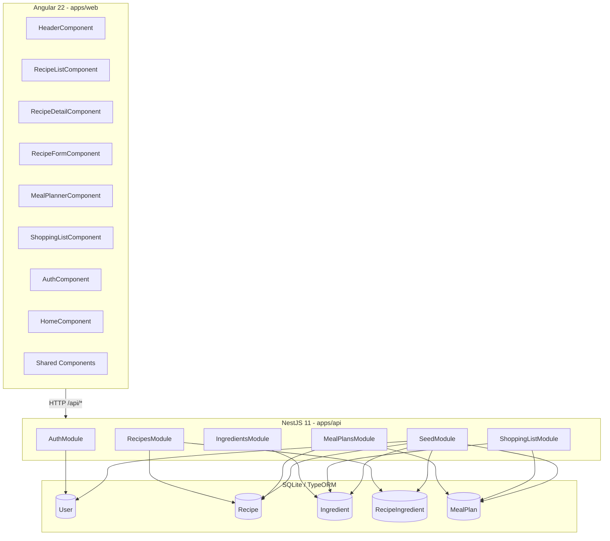

# Architecture

## System Diagram



## Data Flow

1. **Recipe browsing (public):** User visits `/recipes` → `RecipeListComponent` calls `GET /api/recipes` with optional search/filter params → `RecipesService.findAll()` queries TypeORM → returns recipes with nested ingredient relations → frontend renders grid of `RecipeCardComponent`

2. **Meal planning (auth):** User visits `/meal-planner` → `MealPlannerComponent` computes current week Mon-Sun → calls `GET /api/meal-plans?start=DATE&end=DATE` → `MealPlansService.findByDateRange()` queries meals for those dates → frontend renders weekly grid. Adding a meal calls `POST /api/meal-plans` → creates `MealPlan` record.

3. **Shopping list generation:** User clicks "Generate Shopping List" on meal planner or visits `/shopping-list` → calls `GET /api/shopping-list?start=DATE&end=DATE` → `ShoppingListService.getList()` fetches all meal plans in range → collects all ingredients → consolidates by name (sums quantities) → groups by ingredient category → returns structured list.

## Module Architecture

```
apps/api/src/
├── main.ts                  # Bootstrap, CORS, ValidationPipe, Swagger, global prefix
├── app.module.ts            # Root module importing all feature modules
├── config/
│   └── configuration.ts     # Environment variable configuration
├── auth/                    # Feature module: registration, login, JWT
├── recipes/                 # Feature module: recipe CRUD, search, filtering
├── ingredients/             # Feature module: ingredient catalog
├── meal-plans/              # Feature module: weekly meal planning
├── shopping-list/           # Feature module: aggregated shopping list
└── seed/                    # Idempotent database seeder
```

Key architectural decisions:
- **No multi-tenant scoping** — single-user focused (compared to previous 2026-06-24 CRM)
- **Thin controllers** — business logic lives in services
- **DTOs with class-validator** — request validation at the boundary
- **Swagger** — auto-generated API documentation at `/api/docs`
