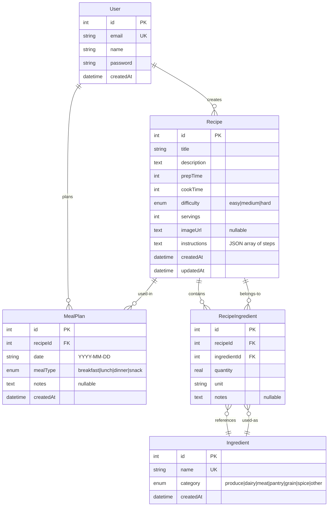

# Database Schema

## Entity Relationship Diagram



## Migration Strategy

The project uses **TypeORM synchronize** for schema management:

```typescript
// apps/api/src/config/configuration.ts
TypeOrmModule.forRootAsync({
  useFactory: (config: ConfigService) => ({
    type: 'better-sqlite3',
    database: config.get<string>('DATABASE_URL', './data/recipes.sqlite'),
    entities: [__dirname + '/**/*.entity{.ts,.js}'],
    synchronize: true, // Auto-sync in development
  }),
  inject: [ConfigService],
})
```

**For production (Neon PostgreSQL migration):**
1. Set `synchronize: false`
2. Write SQL migration files to `apps/api/migrations/`
3. Use TypeORM CLI: `typeorm migration:run`
4. Change database config to use `pg` (postgres) driver instead of `better-sqlite3`

## Neon-Specific Notes

When migrating to Neon PostgreSQL:
- Replace `better-sqlite3` with `pg` and `@nestjs/typeorm` stays compatible
- Use `text` for strings (maps to VARCHAR in PG, TEXT in SQLite) — already done
- Use `real` for decimals — already done
- Use `COALESCE(SUM(x), 0)` for safe aggregation — needed for shopping list consolidation
- Environment detection: `process.env.DATABASE_URL` (full connection string) vs `process.env.DATABASE_PATH` (SQLite path)

## Key Indexes

- `Recipe.title` — full-text search via LIKE (or GIN/tsvector in PG)
- `MealPlan.date` — date range queries for weekly planner
- `Ingredient.name` — unique index for deduplication
- `RecipeIngredient.recipeId` — FK for recipe ingredient joins
- `RecipeIngredient.ingredientId` — FK for ingredient lookup
